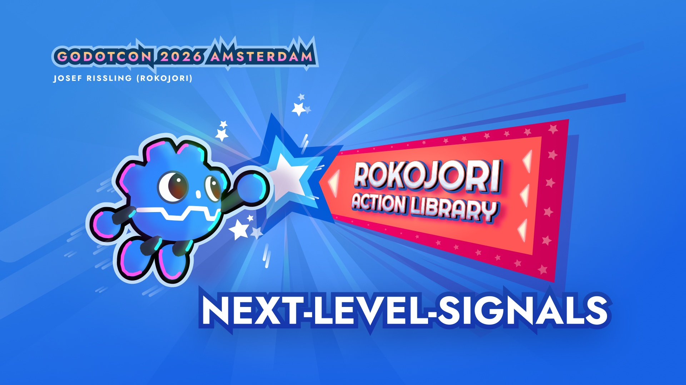

# Project Title

## Overview

This project contains the examples for the talk: Rokojori Action Library - Action: Next-Level-Signals.

It showcases how Actions are used for creating VFX on an Enemy that receives hit impacts.

Learn more on the official website:
👉 https://rokojori.com/en/news/blogs/godot-con-2026/overview

## Video

Here’s a short video of the VFX:

[Watch the video](https://rokojori.com/_media/rokojori-action-library/rokojori-action-library-godot-con-examples.mp4)

This video shows two of the OnHit impact FX chains
